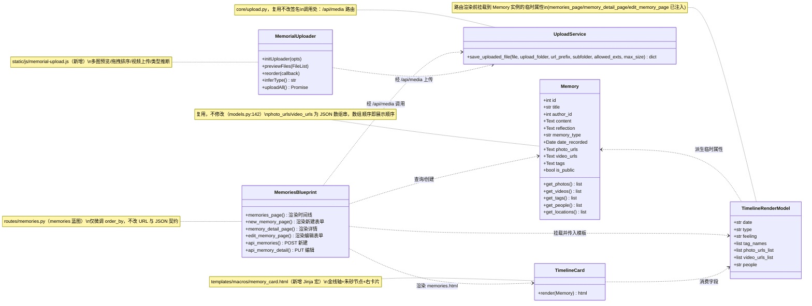
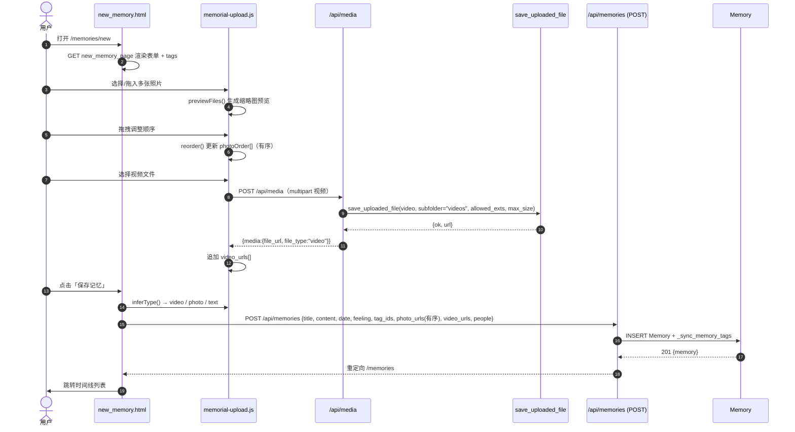
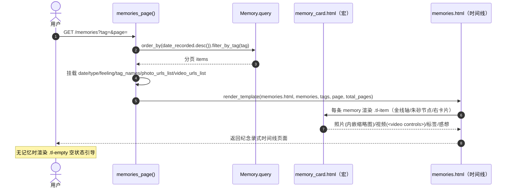
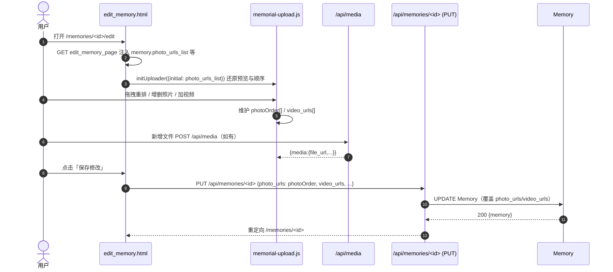
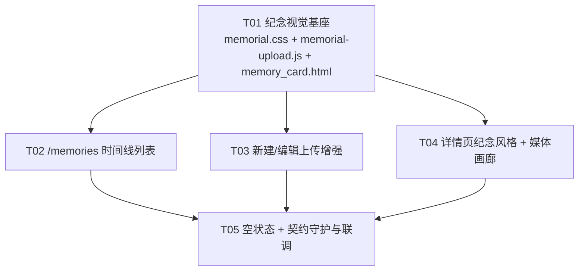

# 系统架构设计 + 任务分解：纪念录式多媒体记忆页面（重设计 /memories）

> 产出角色：架构师（高见远 / Bob）
> 输入：PRD（产品经理 许清楚）——「纪念录式多媒体记忆页面，重设计 /memories」+ 现有系统代码现状
> 目标：将 `/memories` 网格列表重设计为「纪念录式时间线」，温婉庄重，按时间回溯照片/文字/视频记忆；并增强新建/编辑上传体验。
> 约束：沿用 Flask + Jinja2 + Flask-SQLAlchemy + 原生 JS/CSS，**不引入任何新依赖**；保持现有 `/memories`、`/memories/<id>`、`/memories/new`、`/memories/<id>/edit` 的 URL 与 JSON 契约不变（前端契约硬约束）。

---

## 决策摘要（供团队负责人快速拍板）

1. **零新依赖、零模型改动**：`Memory` 模型、`core/upload.py`、`save_uploaded_file()` 全部复用，不新增字段（照片排序由 `photo_urls` JSON 数组顺序天然表达）。
2. **时间线实现**：服务端按 `date_recorded` 降序渲染；前端用一条「金线中轴 + 朱砂节点 + 右卡片」的纯 CSS 垂直布局（无第三方库、无 JS 布局计算）。
3. **多图上传 + 拖拽排序**：复用既有 `/api/media`（POST 多部件）逐张落盘，前端用 `memorial-upload.js` 维护 `photoOrder[]` 数组，HTML5 原生 Drag & Drop 重排；提交时按数组顺序写入 `photo_urls`。视频走同一上传通道，`<video controls>` 内嵌。
4. **共享资产**：新增 `static/css/memorial.css`（时间线/卡片/画廊/上传区样式，全部引用 base.html 设计令牌）与 `static/js/memorial-upload.js`（上传器模块），以及两个 Jinja 宏（`memory_card.html`、`upload_zone.html`、`media_gallery.html`）做 DRY。
5. **任务上限 5 个**（且每个任务 ≥3 个相关文件），按模块分组、按依赖排序；T01 为「共享视觉基座」（既有工程无脚手架可建，故以共享资产作地基等价物）。

> ✅ **范围已锁定**：原第 5 节 7 项待明确已全部由 PM 拍板（见 §5「已拍板结论」），并已并入 T02/T03/T04 范围——网格保留为可切换次要视图、视频上限 50MB、缅怀寄语区与独立年筛选接口划出本迭代、标签云重样式纳入、年分组(P2)纳入、移除 mixed、详情页补充 locations。

> ⚠️ **重要更正（来自实际代码核对）**：PRD 中描述的 `save_uploaded_file(file, subdir=None, allowed_ext=None)` 与实际签名不符。真实签名为：
> `save_uploaded_file(file, *, upload_folder, url_prefix, subfolder="", allowed_exts, max_size=None)`（关键字-only，位于 `core/upload.py`）。
> 上传由路由 `/api/media` 调用，并强制 `ALLOWED_IMAGE_EXTS/ALLOWED_VIDEO_EXTS` 与 `MAX_FILE_SIZE=20MB`。本设计据此展开，工程师须用真实签名。

---

# Part A：系统设计

## 1. 实现方案

### 1.1 技术难点与对策

| 难点 | 对策 |
|------|------|
| **时间线布局需温婉庄重且响应式** | 纯 CSS 实现「左中轴金线 + 朱砂节点 + 右侧卡片」；桌面中轴偏左、移动端贴左并全宽卡片。不引入图表/时间轴库。 |
| **照片多图上传 + 预览 + 拖拽排序** | 复用 `/api/media` 逐张上传得 URL；前端 `memorial-upload.js` 维护有序数组 `photoOrder[]`，预览缩略图支持 HTML5 Drag & Drop 重排；提交时 `photo_urls: photoOrder`（数组顺序=展示顺序，无需新排序字段）。 |
| **视频内嵌播放 + 大小/格式限制** | `<video controls>` 内嵌；复用 `/api/media` 的视频分支（`file_type` 由扩展名推断为 `video`，落 `videos/` 子目录）。限制靠调用处 `allowed_exts` + 既有 `MAX_FILE_SIZE`，前端再做类型/大小预校验。 |
| **保持 URL 与 JSON 契约不变** | 不新增/不改任何路由 URL 与请求/响应字段；仅把 `memories_page()` 的排序由 `create_time.desc()` 改为 `date_recorded.desc()`（视觉需要的"时间回溯"）。 |
| **纪念主题配色一致性** | 全部引用 base.html / style.css 已有设计令牌（`--cinnabar/--gold/--jade/--paper/--ink-*` 等），不写死十六进制（令牌定义除外）。字体用 `--font-display: Noto Serif SC`（标题/正文衬线）。 |
| **详情页现有 CSS 引用了未定义变量** | `memory_detail.html` 现用到 `--primary/--primary-light/--secondary/--bg-warm/--text-light`（`:root` 未定义，会失效）。重设计时统一改用真实令牌。 |

### 1.2 框架与库选型

| 项 | 选型 | 说明 |
|----|------|------|
| Web 框架 | Flask（沿用） | 服务端渲染模板，无 SPA |
| ORM | Flask-SQLAlchemy（沿用） | `Memory` 模型复用，不改 |
| 模板 | Jinja2（沿用） | 继承 `base.html`；页面 CSS 用 ``；共享资产用 `<link>/<script>` 引入 |
| 前端脚本 | 原生 JavaScript（沿用，无 jQuery/无新库） | 拖拽排序用 HTML5 Drag & Drop API；上传用 `fetch` + `FormData` |
| 上传 | `core/upload.py: save_uploaded_file`（沿用） | 经 `/api/media` 路由调用 |
| 时间轴/图表 | 无（纯 CSS + 原生 JS） | 不引入 three.js / 图表库（既有 `/timeline` 的 3D 页保留不变） |

### 1.3 架构模式

- **服务端渲染（SSR）+ 模板继承**：`memories_page()` 查询并按 `date_recorded` 降序分页，挂载渲染期临时属性（`date/type/feeling/tag_names/photo_urls_list/video_urls_list`），传入 `memories.html`；时间线结构由 Jinja 循环 + `memory_card.html` 宏生成。
- **上传与保存分离**：表单不直接落盘，先经 `/api/media` 上传得 URL，再 `POST /api/memories` 仅保存元数据与 URL 数组。编辑时同理 `PUT /api/memories/<id>`（已支持 `photo_urls/video_urls` 覆盖）。
- **约定优于配置**：照片顺序 = `photo_urls` JSON 数组顺序；`memory_type` 由前端 `inferType()` 自动推断（video > photo > text），模型枚举保持不变（`text/photo/video/audio`）。
- **DRY 组件化**：时间线卡片、上传区、媒体画廊抽成 Jinja 宏；上传逻辑抽到 `memorial-upload.js`，供新建/编辑两页共用。

---

## 2. 文件列表（相对路径 + 职责 + 涉及任务）

| 相对路径 | 类型 | 职责 | 任务 |
|----------|------|------|------|
| `static/css/memorial.css` | 新增 | 时间线轴/节点/卡片、纪念画廊、上传区/缩略图/拖拽态、空状态；全部引用 base.html 令牌 | T01（创建）、T04（补充详情样式） |
| `static/js/memorial-upload.js` | 新增 | 多图预览、HTML5 拖拽排序、`memory_type` 自动推断、视频上传封装，导出 `initUploader(opts)` | T01（创建）、T03（被引用） |
| `templates/macros/memory_card.html` | 新增 | Jinja 宏：单条时间线节点+卡片（金线节点+右卡片+照片/视频内嵌+标签+感想） | T01（骨架）、T02（填充） |
| `templates/memories.html` | 重写 | `/memories` 时间线列表：轴/节点/卡片循环、照片/视频内嵌、标签筛选、分页、空状态 | T02 |
| `routes/memories.py` | 微调 | `memories_page()` 排序改 `date_recorded.desc()`；`MAX_FILE_SIZE` 20MB→50MB（P1 视频上限）；确认渲染期属性已注入 | T02、T03 |
| `templates/new_memory.html` | 重写 | 新建表单：多图上传区+预览+拖拽排序、视频上传、`memory_type` 自动推断、保留标题/日期/内容/感想/标签 | T03 |
| `templates/edit_memory.html` | 重写 | 编辑表单：复用上传区，初始化既有 `photo_urls_list` 顺序、支持重排/增删、视频；提交 `PUT` | T03 |
| `templates/macros/upload_zone.html` | 新增 | Jinja 宏：上传拖拽区 + 预览网格 + 拖拽手柄，供 new/edit 共用 | T03 |
| `templates/memory_detail.html` | 重写 | 详情页纪念风格：衬线标题、朱砂印章感、画廊、`<video>` 内嵌、感想框、标签；修正未定义变量 | T04 |
| `templates/macros/media_gallery.html` | 新增 | Jinja 宏：照片网格 + 视频 `<video controls>` 列表，供详情页/卡片复用 | T04 |
| `tests/test_memorial_contract.py` | 新增 | 契约守护：断言 `/memories`、`/api/memories`、`/api/memories/<id>`、`/api/media` 的 URL 与 JSON 字段不变 + 时间线按 `date_recorded` 降序 | T05 |
| `docs/system_design.md` / `docs/class-diagram.mermaid` / `docs/sequence-diagram.mermaid` | 交付 | 本设计文档与图 | 交付 |

> 说明：既有 `templates/timeline.html`（3D three.js 页，路由 `/timeline`）**不在本次范围**，保持不变；`admin_memories.html` 本次可不动。

---

## 3. 数据结构与接口

### 3.1 Memory 模型（沿用，不修改）

字段（`models.py:142`）：`id, title(必填,String200), author_id(FK), content(Text), reflection(Text 感想), memory_type(String20 默认'text'，枚举 text/photo/video/audio), date_recorded(Date 默认当天), photo_urls(Text JSON数组串 默认'[]'), video_urls(Text JSON数组串 默认'[]'), audio_url(String500), thumbnail(String500), people_involved(JSON), locations(JSON), tags(JSON), is_public(Boolean), create_time, update_time`。

辅助方法：`get_photos()/get_videos()/get_tags()/get_people()/get_locations()`（解析对应 Text/JSON 字段）。

**关键事实**：`photo_urls` 是 JSON 数组字符串，**数组顺序即展示顺序** → 照片排序只需前端拖拽后按数组顺序保存，无需新增排序字段。

### 3.2 渲染期视图模型（路由挂载的临时属性）

`memories_page()` / `memory_detail_page()` / `edit_memory_page()` 已在 Memory 实例上挂载：

| 属性 | 来源 | 时间线/详情用途 |
|------|------|----------------|
| `date` | `str(date_recorded)` | 节点日期 |
| `type` | `memory_type` | 类型标记（照片/视频/文字） |
| `feeling` | `reflection` | 感想展示 |
| `tag_names` | `get_tags()` | 标签徽章 |
| `photo_urls_list` | `get_photos()` | 照片 URL 列表（有序） |
| `video_urls_list` | `get_videos()` | 视频 URL 列表 |
| `people` | `", ".join(get_people())` | 相关人物 |

> 模板直接使用上述属性（如 `memory.photo_urls_list`），不要直接解析 `photo_urls` 原始串。

### 3.3 表单字段 → 后端字段映射（JSON 契约，保持不变）

| 表单控件 | 提交字段（/api/memories 或 /api/memories/<id>） | 映射模型字段 |
|----------|-----------------------------------------------|--------------|
| 标题 | `title` | `title` |
| 记忆日期 | `date`（YYYY-MM-DD） | `date_recorded`（`_parse_date`） |
| 记忆内容（描述） | `content` | `content` |
| 个人感受（感想） | `feeling` | `reflection` |
| 记忆类型 | `type`（前端 `inferType()` 推断，可手动覆盖） | `memory_type` |
| 相关人物 | `people`（逗号分隔） | `people_involved`（CSV→JSON） |
| 标签 | `tag_ids[]` | `tags`（JSON）+ `MemoryTag` 关联（`_sync_memory_tags`） |
| 配图（有序） | `photo_urls[]`（数组顺序=展示顺序） | `photo_urls`（JSON 数组） |
| 视频 | `video_urls[]` | `video_urls`（JSON 数组） |

**上传契约（不变）**：`POST /api/media`（multipart `file`）→ 返回 `{media:{id, file_url, file_type, file_size}}`；前端把 `file_url` 收集进 `photo_urls[]` / `video_urls[]`。`PUT /api/memories/<id>` 已支持 `photo_urls` / `video_urls` 覆盖 → 编辑重排无需改后端。

### 3.4 类图（Mermaid）



---

## 4. 程序调用流程（Mermaid）

### 4.1 主流程一：新建记忆（多图拖拽排序 + 视频上传）



### 4.2 主流程二：时间线列表渲染



### 4.3 主流程三：编辑记忆（保留照片顺序 + 重排）



---

## 5. 待明确事项 → 已拍板结论（PM 锁定）

> 以下 7 项经产品经理许清楚拍板锁定，直接约束 T02/T03/T04 范围；第 8 项为架构侧默认处理。结论已并入对应任务（见 §7）。

1. **网格视图去留（已拍板：保留切换）**：默认以**时间线为主视图**；网格作为「可切换次要视图」保留（列表页顶部切换按钮，默认时间线）。`memories.html` 同时含时间线与网格两套渲染，网格复用旧 `.memory-grid` 语义并映射到纪念主题视觉。
2. **视频大小上限（已拍板：50MB）**：产品侧采纳 **50MB**。⚠️ 技术前置：须同步调高服务器/Nginx `client_max_body_size` 与 `/api/media` 的 `MAX_FILE_SIZE`（由 `20MB → 50MB`），否则前端放宽仍会被网关截断；前端校验文案同步更新。→ 见 T03。
3. **缅怀寄语区（P2，已拍板：本次不做）**：维持本迭代聚焦核心重设计；新建留言模型/表/接口工作量超出预算，明确划出，纳入下一迭代。
4. **时间范围筛选 / 标签云（已拍板：拆分）**：
   - 标签云：**纳入本次**，仅「复用现有 `?tag=` + 标签云并映射到纪念主题视觉」，几乎零新增逻辑（memories.html 已有）。
   - 按年范围筛选：**P2 最小化**，若 T03 排期有余则做，否则顺延；不影响主时间线交付。
5. **`memory_type` 枚举与表单（已拍板：移除 mixed）**：统一为模型枚举（`text/photo/video/audio`）+ 前端 `inferType()` 自动推断（有视频→video，有照片→photo，否则 text）。new/edit 表单移除 `mixed` 选项。
6. **时间线按年分组（已拍板：做，P2 视觉增强）**：时间线按 `date_recorded` 年份插入年份分隔（如 2023 / 2022），提升叙事感与长列表导航；模板层按相邻项年份变化插入分隔，无需改路由。
7. **详情页字段范围（已拍板：部分补充）**：
   - **locations：纳入展示**，复用 `get_locations()`，以黛绿（`--jade`）小字呈现，与列表卡片一致。
   - **相关人物档案链接：延后**；当前仅展示人物姓名（`get_people()`），不新增 profile 跳转。注：仓库已存在 `People` 模型（models.py:203）与 `/people/<pid>` 路由、`person.html` 模板；若 PM 评估本迭代接入，可在 T04 追加「人物姓名 → 档案链接」（待 PM 二次确认）。
8. **移动端时间线轴位置（架构默认）**：桌面「左中轴」、移动端「贴左全宽卡片」，已在共享约定中默认采用。

→ 第 3、4（年筛选）、7（人物链接）项不在本迭代交付范围；其余已并入对应任务。

---

# Part B：任务分解

## 6. 依赖包

```
# 不新增任何第三方依赖（纯 Flask 栈 + 原生前端）
# 现有依赖（requirements.txt，保持不变）：
Flask>=2.3.0
Flask-SQLAlchemy>=3.0.0
Flask-CORS>=4.0.0
Flask-Login>=0.6.0
Werkzeug>=2.3.0
SQLAlchemy>=2.0.0
flasgger>=0.9.0
Pillow>=10.0.0

# 前端：无新库（无 jQuery、无拖拽库、无时间轴库）
# 仅新增原生资源：static/css/memorial.css、static/js/memorial-upload.js
```

---

## 7. 任务列表（有序，含依赖、按实现顺序，≤5 个，每个 ≥3 相关文件）

> 说明：本项目为既有（brownfield）工程，无脚手架可建；故 T01「共享视觉基座」作为等效的「项目基础设施」任务（所有页面共用 CSS 令牌约定 + 上传器模块 + 卡片宏）。

### T01 — 纪念视觉基座：共享样式 + 上传器模块 + 卡片宏  【P0】
- **源文件**：`static/css/memorial.css`（新增）、`static/js/memorial-upload.js`（新增）、`templates/macros/memory_card.html`（新增，骨架）
- **依赖**：无
- **优先级**：P0
- **内容**：
  - `memorial.css`：定义时间线令牌化样式（`.tl-axis` 金线、`.tl-node` 朱砂节点、`.tl-item`、`.tl-card`、`.tl-date`、`.tl-empty` 空状态）、纪念画廊、上传区（`.mem-upload-zone`、`.mem-thumb`、`.mem-thumb.dragging`）、响应式（桌面中轴 / 移动贴左）。**全部引用 base.html 令牌，不写死十六进制**。
  - `memorial-upload.js`：导出 `initUploader(opts)`，封装 `previewFiles() / reorder() / inferType() / uploadAll()`；维护 `photoOrder[]` 与 `videoUrls[]`；HTML5 Drag & Drop 重排；`inferType()` 规则 video>photo>text。
  - `memory_card.html`：先搭宏骨架（入参 Memory 渲染节点+卡片容器），T02 填充内容映射。

### T02 — /memories 时间线列表重设计（含网格切换 / 标签云 / 年分组）  【P0】
- **源文件**：`templates/memories.html`（重写）、`routes/memories.py`（微调）、`templates/macros/memory_card.html`（填充）
- **依赖**：T01
- **优先级**：P0
- **内容**：
  - `memories.html`：
    - 默认渲染**时间线**（循环 `memories`，每条调用 `memory_card.html` 宏：金线节点+右卡片；照片内嵌缩略图、视频 `<video controls>`；locations 以 `--jade` 小字呈现）。
    - **网格切换**：顶部切换按钮（默认时间线），网格作为次要视图复用 `.memory-grid` 语义并映射到纪念主题视觉（金/朱砂点缀）。
    - **标签云**：复用现有 `?tag=` 与标签云，仅映射到纪念主题视觉（`.tag-badge` 用令牌），零新增筛选逻辑。
    - **年分组（P2 视觉增强）**：模板层按相邻项 `date_recorded` 年份变化插入年份分隔（如 2023/2022），无需改路由。
    - 保留 `?tag=` 筛选与分页；无记忆时渲染 `.tl-empty` 空状态引导（链接 `/memories/new`）。
  - `routes/memories.py`：`memories_page()` 排序改为 `order_by(Memory.date_recorded.desc(), Memory.create_time.desc())`；确认渲染期属性已注入。**不改 URL/分页参数/JSON 契约**。
  - `memory_card.html`：完善卡片内容映射（标题/日期/类型/照片/视频/标签/感想摘要/locations），引用 `memorial.css` 类。

### T03 — 新建/编辑页上传体验增强（含 50MB / 移除 mixed / 自动推断）  【P1】
- **源文件**：`templates/new_memory.html`（重写）、`templates/edit_memory.html`（重写）、`templates/macros/upload_zone.html`（新增）、`routes/memories.py`（`MAX_FILE_SIZE` 20MB→50MB + 前端校验文案）
- **依赖**：T01
- **优先级**：P1
- **内容**：
  - `upload_zone.html`：上传拖拽区 + 预览网格 + 拖拽手柄宏，new/edit 共用。
  - `new_memory.html`：接入 `initUploader` 与 `upload_zone.html`；多图选择/拖入、预览、拖拽排序；视频上传；`inferType()` 自动推断类型（有视频→video，有照片→photo，否则 text）；提交 `POST /api/memories`（含有序 `photo_urls`、`video_urls`）。保留标题/日期/内容/感想/标签。**移除 `mixed` 类型选项**。
  - `edit_memory.html`：`initUploader({initial: memory.photo_urls_list})` 还原既有照片顺序，支持重排/增删/加视频；提交 `PUT /api/memories/<id>`（覆盖 `photo_urls`/`video_urls`）。**移除 `mixed`**。
  - `routes/memories.py`：`MAX_FILE_SIZE` 由 `20*1024*1024` 改为 `50*1024*1024`（配合 PM 拍板 50MB）。⚠️ **部署前置**：须同步调高服务器/Nginx `client_max_body_size`（建议 ≥60MB 余量），否则网关仍截断；前端校验文案同步更新为 50MB。

### T04 — 详情页纪念风格重设计 + 媒体画廊（含 locations）  【P1】
- **源文件**：`templates/memory_detail.html`（重写）、`templates/macros/media_gallery.html`（新增）、`static/css/memorial.css`（补充详情样式）
- **依赖**：T01
- **优先级**：P1
- **内容**：
  - `media_gallery.html`：照片网格 + 视频 `<video controls>` 列表宏，供详情页/卡片复用。
  - `memory_detail.html`：纪念风格——衬线标题（`--font-display`）、朱砂印章感分隔、照片画廊、视频内嵌、感想框（温柔底色）、标签徽章、返回/编辑/删除。**修正现有未定义变量（`--primary/--primary-light/--secondary/--bg-warm/--text-light`）→ 改用真实令牌**。灯箱预览复用现有 `openLightbox` 逻辑。**locations 以 `--jade` 小字呈现（复用 `get_locations()`）**。相关人物仅展示姓名（`get_people()`），**不新增 profile 跳转**（仓库已有 `People` 模型与 `/people/<pid>`，是否本迭代接入待 PM 二次确认）。
  - `memorial.css`：补充详情页专属纪念样式（印章、画廊、感想框、locations 小字）。

### T05 — 空状态完善 + 契约守护与联调  【P1 / 验收】
- **源文件**：`tests/test_memorial_contract.py`（新增）、`templates/memories.html`（空状态打磨）、`templates/memory_detail.html`（回链/删除联调）
- **依赖**：T02、T03、T04
- **优先级**：P1
- **内容**：
  - `test_memorial_contract.py`：断言 URL 与 JSON 字段不变（`/memories` 渲染、`GET /api/memories`、`POST /api/memories`、`PUT /api/memories/<id>`、`POST /api/media`）；断言时间线按 `date_recorded` 降序；断言 `photo_urls` 数组顺序被保留（排序契约）。
  - `memories.html`：打磨 `.tl-empty` 空状态引导文案与样式。
  - 联调：新建（多图+视频+重排）→ 时间线正确展示顺序；编辑重排后顺序保存；详情页视频可播；现有 URL/JSON 契约无回归。

---

## 8. 共享知识（跨文件约定）

- **CSS 类约定（时间线）**：`.tl`（timeline 前缀）——`.tl-axis`（金线中轴）、`.tl-item`、`.tl-node`（朱砂节点）、`.tl-date`、`.tl-card`、`.tl-card-media`、`.tl-empty`（空状态）。详见 `memorial.css`。
- **CSS 类约定（上传）**：`.mem-upload-zone`（拖拽区）、`.mem-thumb`（预览缩略图）、`.mem-thumb.dragging`（拖拽态）、`.mem-thumb.handle`（拖拽手柄）。
- **照片顺序约定**：`photo_urls` JSON 数组顺序 = 展示/上传顺序；前端 `photoOrder[]` 即该顺序，**不引入任何排序字段**。
- **视频约定**：一律 `<video controls>`，`<source>` 的 `type` 用 `video/mp4`（优先）兜底；多视频各自一个 `<video>`。**视频上传上限 50MB**（已上调 `MAX_FILE_SIZE`）；部署须同步 Nginx `client_max_body_size`，前端校验文案同步为 50MB。
- **纪念配色**：只引用 base.html / style.css 令牌（`--cinnabar #c45c48`、`--cinnabar-light`、`--cinnabar-pale`、`--gold #b8956a`、`--gold-light`、`--gold-pale`、`--jade #5a8a7f`、`--jade-light`、`--jade-pale`、`--paper #faf8f3`、`--paper-warm`、`--paper-deep`、`--ink*`、`--font-display` 等）；新 CSS **不写死十六进制**（令牌定义除外）。
- **字体**：标题/印章用 `--font-display: "Noto Serif SC"`（衬线）；正文用 `--font-body: "Noto Sans SC"`。
- **上传通道**：所有媒体经 `POST /api/media`（multipart `file`），返回 `{media:{file_url, file_type}}`；前端收集 `file_url`。调用 `save_uploaded_file` 须用真实关键字签名：`save_uploaded_file(file, *, upload_folder, url_prefix, subfolder, allowed_exts, max_size)`。
- **类型推断**：`inferType()` 规则 `video > photo > text`（移除表单 `mixed` 选项，模型枚举仅 `text/photo/video/audio`）。
- **视图切换（网格/时间线）**：列表页默认**时间线**；顶部切换按钮可切到**网格**（复用 `.memory-grid` 语义并映射纪念视觉），默认时间线。
- **标签云**：复用现有 `?tag=` 与标签云，仅映射到纪念主题视觉（`.tag-badge` 用令牌），零新增筛选逻辑。
- **年分组**：时间线模板层按相邻项 `date_recorded` 年份变化插入年份分隔（如 2023/2022），无需改路由。
- **locations 展示**：列表卡片与详情页均以 `--jade` 小字呈现（复用 `get_locations()`）；相关人物仅展示姓名，本迭代不接 profile 跳转。
- **资源引入**：共享 `memorial.css` / `memorial-upload.js` 经模板 `` / `` 用 `{{ url_for('static', filename=...) }}` 引入；页面级样式仍可用内联 `<style>`。
- **硬契约**：现有 `/memories`、`/memories/<id>`、`/memories/new`、`/memories/<id>/edit` 的 URL 与 JSON 请求/响应字段一律不变。

---

## 9. 任务依赖图（Mermaid）


